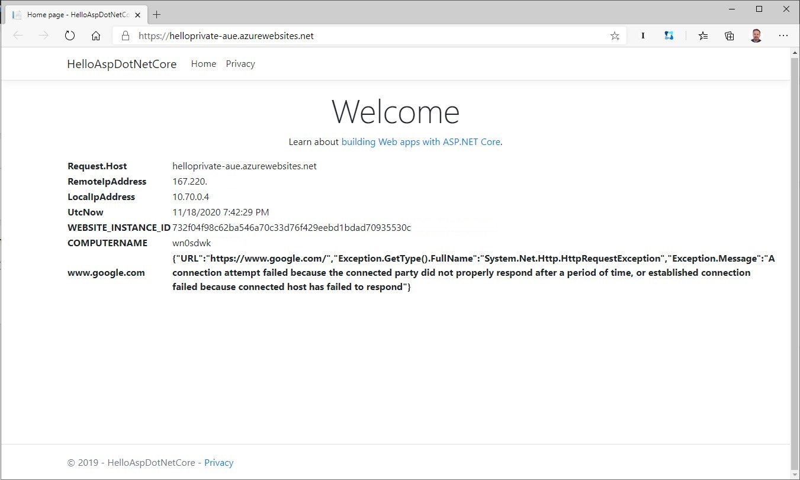

# Hello ASP.NET Core

A simple Hello World ASP.NET Core website with a couple of features for testing.



[](https://github.com/DanielLarsenNZ/HelloAspDotNetCore/actions/workflows/main.yml)

> Try it out: <https://hello-aspnet.azurewebsites.net>

> See also [DanielLarsenNZ/HelloFunctionsDotNetCore](https://github.com/DanielLarsenNZ/HelloFunctionsDotNetCore)

## Getting started

With [Azure CLI](https://docs.microsoft.com/en-us/cli/azure/install-azure-cli):

```
az group create -n helloaspnet-rg -l westus2
az appservice plan create -g helloaspnet-rg -n helloaspnet-plan --is-linux --sku FREE
az webapp create -g helloaspnet-rg -p helloaspnet-plan -n hello-aspnet -i daniellarsennz/helloaspdotnetcore
```

## App Settings

* `Colour` - Sets the background colour of the Footer
* `loader.io` The loader.io validation key. When this setting is present the app will respond to [loader.io](https://loader.io) host validation requests.
* `StartupDelaySeconds` - The number of seconds to delay the ASP.NET Core startup process (to simulate application startup). If this setting is missing, empty or not an integer, there will be no delay.
* `GetUrls` - A semicolon delimited list of URL's to get. If present, the page will request these URLs and return the reponse code for each request.
* `AzureCacheRedisConnectionString` - Connection string for a Redis server instance (does not have to be Azure Cache for Redis). When present, home page will get, increment and set a cached integer value.

### Blob settings

When these two settings are present, the text content of a Blob will be displayed on the home page.

* `Blob.StorageConnectionString` - Storage Account Connection String
* `Blob.Path` - Path to a Blob in the format `container/path/to/file` to display the contents of on the home page
